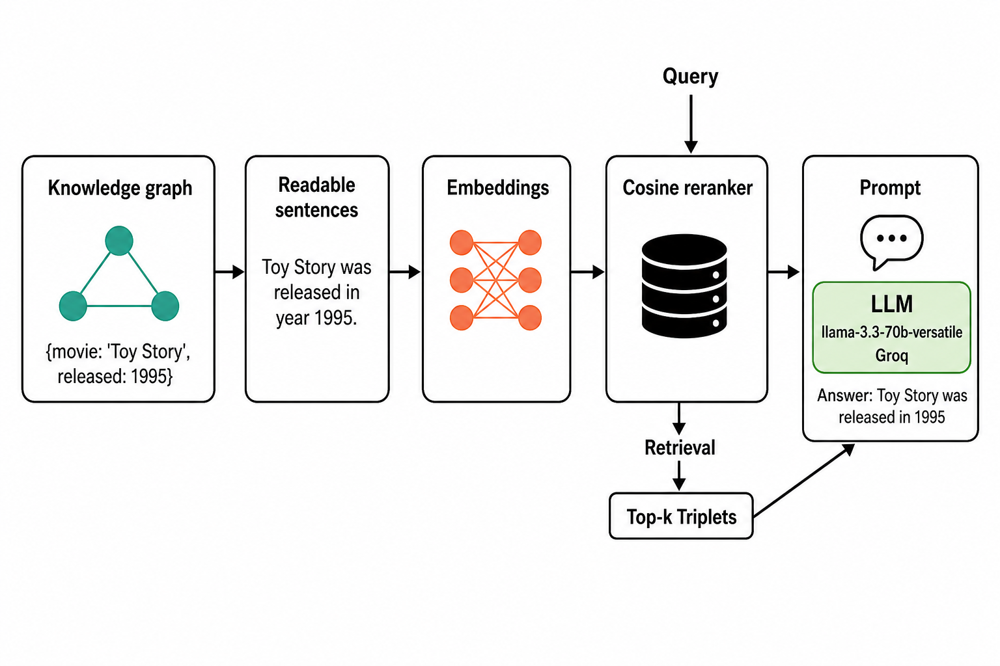

# Graph-Based Intelligent Movie Recommendation System Using RAG 

> **Course:** CMPE 258 - Deep Learning (Spring 2026)  
> **Group:** 19  
> **GitHub:** [Graph-Based-Intelligent-Movie-Recommendation-System-Using-RAG](https://github.com/abharathkumarr/Graph-Based-Intelligent-Movie-Recommendation-System-Using-RAG)

## Team Members

| Name | Student ID | Email |
|------|------------|-------|
| Bharath Kumar A | 018221268 | bharathkumar.a@sjsu.edu |
| Saripella Sriyavarma | 019130553 | sriyavarma.saripella@sjsu.edu |
| Venkata Siva Sai Krishna Prasad Y | 018320835 | venkatasivasaikrishnaprasad.yedupati@sjsu.edu |

---

## Submission Index (for the reviewer)

| If you want to see... | Open this file |
|---|---|
| **Final project report (Turnitin upload)** | [`report/Report_Final.pdf`](./report/Report_Final.pdf) |
| Editable Word version of the report | [`report/Report_Final.docx`](./report/Report_Final.docx) |
| Final presentation slides | [`report/CMPE258_Project.pptx`](./report/CMPE258_Project.pptx) |
| Project proposal | [`report/CMPE258_ProjectProposal.pdf`](./report/CMPE258_ProjectProposal.pdf) |
| Main implementation + evaluation code | [`CMPE258_Project_Code.ipynb`](./CMPE258_Project_Code.ipynb) |
| Streamlit demo UI source | [`app_full.py`](./app_full.py) |
| Per-query evaluation results | [`evaluation/eval_detailed_results.csv`](./evaluation/eval_detailed_results.csv) |
| Per-model summary table | [`evaluation/eval_model_summary.csv`](./evaluation/eval_model_summary.csv) |
| Evaluation plots (4 figures) | [`evaluation/`](./evaluation/) |
| Architecture diagram | [`pipeline.png`](./pipeline.png) |
| Rubric alignment | [`docs/RUBRIC_ALIGNMENT.md`](./docs/RUBRIC_ALIGNMENT.md) |

---

## Overview

This project implements an **intelligent movie recommendation system** that combines the structured knowledge of **Knowledge Graphs** with the natural language understanding of **Large Language Models (LLMs)** using **Retrieval-Augmented Generation (RAG)**.

**Key Features:**
- 🎯 **Fact-Grounded Recommendations**: All suggestions are backed by verifiable knowledge graph facts
- 🔍 **Semantic Search**: 229,894 knowledge triplets indexed using FAISS for efficient retrieval
- 🤖 **Natural Language Interface**: Ask questions in plain English and get contextual recommendations
- 📊 **Knowledge Graph Visualization**: Interactive UI displaying the underlying graph structure
- ⚡ **Fast Inference**: Powered by Groq's llama-3.3-70b-versatile model

---

##  Motivation

Traditional recommendation systems rely heavily on collaborative or content-based filtering, which often fail to capture deeper relationships between entities. This project aims to **enhance movie recommendations** using:
- **Knowledge Graphs (KGs)** to model semantic connections between movies, actors, directors, and genres
- **Retrieval-Augmented Generation (RAG)** to provide interpretable, grounded responses using LLMs
- **Semantic Search** to find relevant context based on meaning, not just keywords

---

## Architecture



### Pipeline Components

1. **Knowledge Graph**: Neo4j database containing movie entities and relationships
2. **Readable Sentences**: Triplets converted to natural language (e.g., "Toy Story was released in year 1995")
3. **Embeddings**: 384-dimensional vectors generated using SentenceTransformers
4. **Cosine Reranker**: FAISS index for efficient similarity search with top-k retrieval
5. **Prompt + LLM**: Retrieved context fed to llama-3.3-70b-versatile for answer generation

---

## Dataset

- Source: [Neo4j “recommendations” dataset](https://github.com/neo4j-graph-examples/recommendations)
- Entities & Relationships:
  - `(:Movie)-[:IN_GENRE]->(:Genre)`
  - `(:User)-[:RATED]->(:Movie)`
  - `(:Actor)-[:ACTED_IN]->(:Movie)`
  - `(:Director)-[:DIRECTED]->(:Movie)`
- **Nodes**: 28,865  
- **Edges**: 166,262

---

##  Methodology

### 1. 📊 Knowledge Triplet Construction
- Extract triplets from Neo4j graph database
- Convert structured data into human-readable sentences:
  ```
  {'movie': 'Toy Story', released: 1995} → "Toy Story was released in year 1995"
  ```
- **Total Knowledge Sentences**: 229,894

### 2. 🔤 Embedding Generation
- Model: **SentenceTransformers** (`all-MiniLM-L6-v2`)
- Output: 384-dimensional dense vector embeddings
- Captures semantic meaning of knowledge triplets

### 3. 🗄️ FAISS Indexing
- Algorithm: **FAISS IndexFlatL2** (L2 distance)
- Enables fast approximate nearest neighbor search
- Retrieves top-k most relevant triplets (k=500) for each query

### 4. 📐 Cosine Reranking
- Post-processing step using cosine similarity
- Improves retrieval precision by reordering FAISS results
- Ensures most semantically relevant context is prioritized

### 5. 🤖 Retrieval-Augmented Generation (RAG)
- **LLM**: Groq-hosted **llama-3.3-70b-versatile**
- **Framework**: LangChain for pipeline orchestration
- **Process**:
  1. User query embedded and matched against knowledge base
  2. Top-k relevant triplets retrieved
  3. Context + query formatted into structured prompt
  4. LLM generates natural language recommendations
  5. Response includes explanations grounded in retrieved facts

### 6. 📈 Evaluation Metrics
- **Precision@k** = Relevant retrieved / Total retrieved  
- **Recall@k** = Relevant retrieved / Total relevant  
- **F1 Score** = Harmonic mean of Precision and Recall
- **Response Time** = End-to-end query processing latency

---

## Interactive UI

We've built a **Streamlit-based web application** that provides an intuitive interface for movie recommendations:


*Live demo: a natural-language query ("Can you recommend me a recent movie with Adventure genre and rating greater than 3 with actor Leonardo DiCaprio") is answered with a grounded recommendation. The sidebar exposes the LLM model selector, structured-log toggle, and session memory; the main panel shows the response time (1.45s), the selected model (llama-3.3-70b-versatile), and the lexical grounding score (0.25) for evaluation-first transparency.*

### Features
- **Natural Language Queries**: Ask questions in plain English
- **Example Queries**: Pre-configured queries for quick testing
- **Knowledge Graph Visualization**: Background displays the actual graph structure
- **Real-time Recommendations**: Powered by Groq API for fast inference
- **Response Metrics**: Shows processing time, model used, and grounding score

### How to Run

1. **Install Dependencies**:
   ```bash
   pip install -r requirements_ui.txt
   ```

2. **Set Your Groq API Key**:
   ```bash
   export GROQ_API_KEY="your_api_key_here"
   ```

3. **Launch the App**:
   ```bash
   ./run_app.sh
   # or directly: streamlit run app_full.py
   ```

4. **Access the UI**: Open `http://localhost:8502` in your browser

### Example Queries
- "Find movies with rating above 8.0"
- "List adventure movies released after 2010"
- "Movies acted by Leonardo DiCaprio"
- "Comedy movies produced in USA"
- "Action movies with budget over $100M"

---

## Results

### Extended Evaluation: 51 Queries x 3 Groq LLMs

We evaluated three Groq-hosted LLMs on the same 51 natural-language queries with the
same retriever and prompt. 15 queries have Cypher-derived ground truth used for
Precision/Recall/F1; the remaining 36 contribute latency and non-empty-answer-rate
evidence.

| Model | P@10 | R@10 | F1@10 | Mean Latency | Non-empty |
|---|---|---|---|---|---|
| **llama-3.1-8b-instant** (production pick) | **0.707** | **0.225** | **0.317** | **2.97 s** | 51/51 |
| openai/gpt-oss-20b | 0.507 | 0.165 | 0.225 | 6.59 s | 43/51 |
| llama-3.3-70b-versatile | 0.127 | 0.019 | 0.031 | 7.92 s | 5/51 |

Raw artifacts: see [`evaluation/`](./evaluation/) for the full per-query CSVs and the
4 result figures. Full write-up: [`report/Report_Final.pdf`](./report/Report_Final.pdf).

### Key Achievements
- **Fact-Grounded Recommendations**: All suggestions are backed by verifiable knowledge graph triplets.
- **High Retrieval Quality**: Retrieved facts consistently match Neo4j Cypher query outputs.
- **Evaluation-driven model selection**: The production pick is justified by Pareto-optimal F1@10 AND latency, not by defaulting to the largest model.
- **Interactive demo**: Streamlit UI with model switching, pipeline trace, and grounding score for live qualitative verification.

---

## Progress Update

### ✅ Completed

**Data Extraction & Processing**
- Successfully extracted 229,894 knowledge triplets from Neo4j database
- Converted graph relationships into natural language sentences
- Processed all movie, actor, director, genre, and user rating entities
- Serialized embeddings and sentences using pickle for efficient loading

**Embedding & Indexing**
- Generated 384-dimensional embeddings using SentenceTransformers (all-MiniLM-L6-v2)
- Built FAISS IndexFlatL2 for efficient similarity search
- Implemented cosine similarity re-ranking for improved retrieval quality
- Optimized index size: 337MB embeddings, 9.3MB sentences

**RAG Pipeline Implementation**
- Integrated llama-3.3-70b-versatile via Groq API with LangChain
- Created custom prompt templates for movie recommendations
- Implemented RetrievalQA chain with optimized retrieval parameters (k=500)
- Successfully tested end-to-end pipeline with diverse queries

**Web Application (Streamlit UI)**
- Built interactive web interface with natural language query input
- Integrated knowledge graph visualization as background
- Added example queries with one-click execution
- Implemented real-time response display with processing metrics
- Styled UI with blue/black/white theme matching graph aesthetics
- Added About section with project information

**Evaluation**
- Implemented Precision@k, Recall@k, and F1-score metrics
- Tested on sample queries with ground truth comparison
- Documented baseline performance metrics
- Validated retrieval accuracy against Neo4j Cypher queries

**Documentation & Code Organization**
- Cleaned up repository structure
- Created comprehensive README with usage instructions
- Updated architecture diagram with correct model information
- Organized assets folder with UI resources

---

## Technical Stack

**Backend**
- 🗄️ **Database**: Neo4j (Graph Database)
- 🔤 **Embeddings**: SentenceTransformers (`all-MiniLM-L6-v2`)
- 🔍 **Search**: FAISS (Facebook AI Similarity Search)
- 🤖 **LLM**: llama-3.3-70b-versatile via Groq API
- ⛓️ **Framework**: LangChain

**Frontend**
- 🎨 **UI Framework**: Streamlit
- 🌐 **Visualization**: Custom CSS with knowledge graph background
- 📊 **Components**: Interactive query interface, example queries, results display

**Dependencies**
- `streamlit` - Web application framework
- `langchain`, `langchain-groq` - RAG pipeline orchestration
- `sentence-transformers` - Embedding generation
- `faiss-cpu` - Vector similarity search
- `neo4j` - Graph database driver

---

## Repository Structure

The repository is grouped by purpose so a reviewer can find each deliverable at a glance:

```
.
|-- README.md                       # This file (project overview + quickstart)
|-- LICENSE                         # MIT license
|-- pipeline.png                    # Architecture diagram (referenced by README + report)
|-- .env.example                    # Documents GROQ_API_KEY (no real key in repo)
|-- .gitignore                      # Excludes secrets, *.pkl, logs, local backups
|-- requirements.txt                # Notebook dependencies
|-- requirements_ui.txt             # Streamlit UI dependencies
|-- run_app.sh                      # Launches the Streamlit demo
|-- app_full.py                     # Streamlit UI (multi-model, grounding, pipeline trace)
|-- generate_report.py              # Reproducible Report_Final.{docx,pdf} builder
|-- CMPE258_Project_Code.ipynb      # Main implementation + evaluation notebook
|-- knowledge_graph_ACTED_IN.html   # KG visualization used by the demo
|
|-- data/                           # INPUT to the evaluation
|   `-- eval_queries.json           # 51-query evaluation set
|
|-- assets/                         # UI assets
|   `-- knowledge_graph_bg.png      # Background image for the Streamlit demo
|
|-- docs/                           # SUPPORTING DOCUMENTATION
|   |-- USAGE.md                    # End-user usage instructions
|   |-- DEPLOYMENT.md               # Hosting / deployment notes
|   |-- MODEL_FILES.md              # How to obtain the .pkl knowledge files
|   |-- CHANGELOG.md                # Release log
|   |-- CONTRIBUTING.md             # Contribution guidelines
|   `-- RUBRIC_ALIGNMENT.md         # Mapping to the CMPE 258 rubric
|
|-- evaluation/                     # EVALUATION EVIDENCE (Section 7 of the report)
|   |-- evaluation_visualizations.py
|   |-- eval_detailed_results.csv   # Full per-query metrics for all 3 models
|   |-- eval_model_summary.csv      # Aggregated mean metrics per model
|   |-- eval_partial_*.csv          # Per-model snapshots (3 files)
|   |-- eval_model_quality_latency.png
|   |-- eval_llama_3_1_8b_instant_per_query_metrics.png
|   |-- eval_llama_3_1_8b_instant_precision_recall_vs_k.png
|   `-- eval_llama_3_1_8b_instant_confusion_matrix.png
|
`-- report/                         # SUBMISSION DELIVERABLES
    |-- Report_Final.pdf            # <- Upload this to Canvas (Turnitin-ready)
    |-- Report_Final.docx           # Editable Word version of the report
    |-- Report.pdf                  # Team's original draft (kept for reference)
    |-- CMPE258_Project.pptx        # Final presentation slides
    `-- CMPE258_ProjectProposal.pdf # Original project proposal
```

Large pickle files (`triplet_sentences.pkl`, `triplet_embeddings.pkl`) are excluded from
git via `.gitignore`; see [`docs/MODEL_FILES.md`](./docs/MODEL_FILES.md) for how to
obtain them.

---

## Future Enhancements

**Potential Improvements:**
- 🔄 **Hybrid Retrieval**: Combine vector search with direct Neo4j graph traversal
- 🎯 **Personalization**: User history-based recommendations
- 🔗 **Multi-hop Reasoning**: Chain multiple graph queries for complex requests
- 📊 **Enhanced Metrics**: A/B testing, user satisfaction scores
- 🌐 **Multi-modal**: Support for movie posters, trailers, reviews

---

##  References

- [Lewis et al. (2021). Retrieval-Augmented Generation (RAG)](https://arxiv.org/abs/2005.11401)  
- [Hogan et al. (2022). Knowledge Graphs](https://doi.org/10.1145/3447772)  
- [KG-Retriever (2023)](https://arxiv.org/html/2412.05547v1)  
- [Nair & Cheriyan (2023)](https://doi.org/10.1109/idciot56793.2023.10053435)  
- [Xu et al. (2024)](https://doi.org/10.1145/3626772.3661370)  
- [Neo4j Example Datasets](https://neo4j.com/docs/getting-started/appendix/example-data/)

---

## License

This project is developed as part of CMPE 258 - Deep Learning course at San Jose State University.

---

**Ready to explore?** Run `./run_app.sh` and start asking movie questions! 🎬🍿
